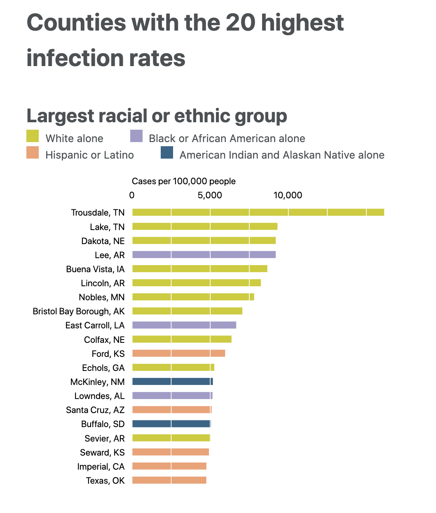
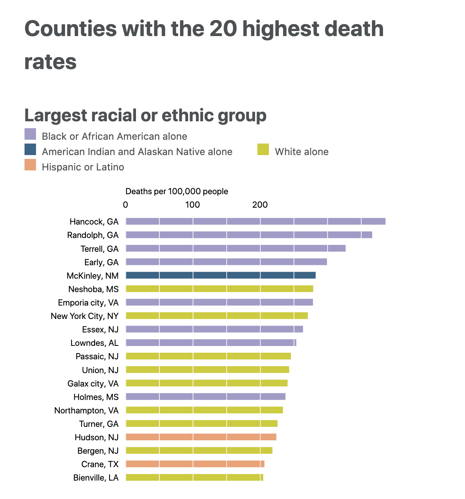
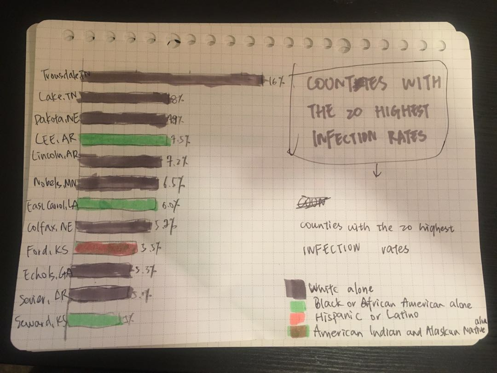
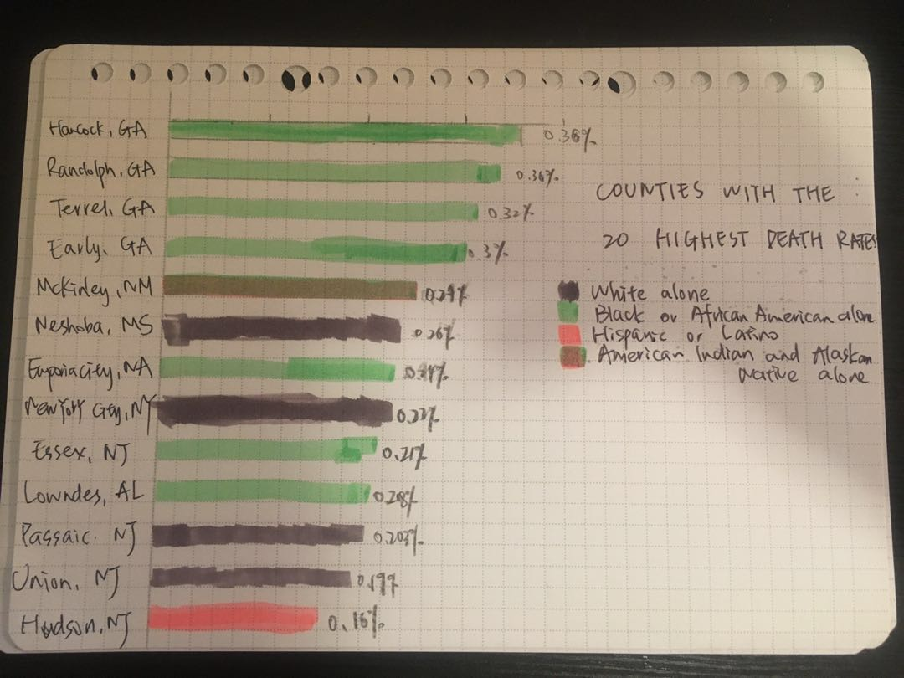
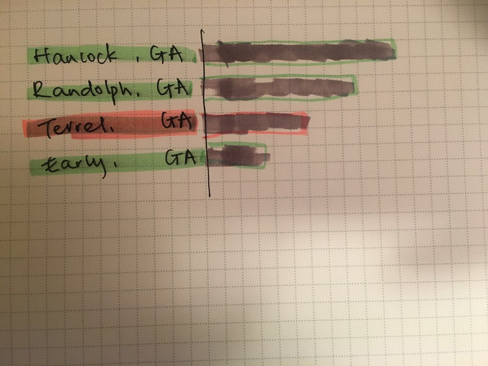
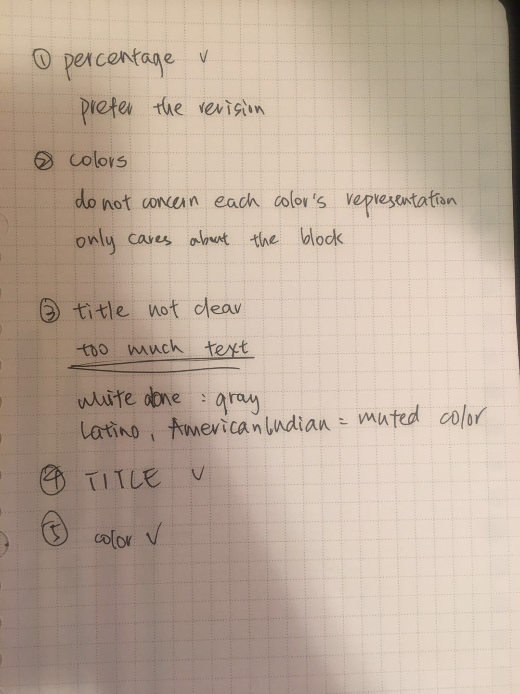

# Redesign of Covid Situation by Races

I got the data from [the dataset](https://covidtracking.com/race), it shows how infection rates and death rates differ for counties based on the main race of thier residents. 

## The Original Viz
The website originally has the visualizations like this

I think this set of visualizations mostly have problems in its layout, colors and lables. 
There is too much text, and all bolded. The colors' representations are far away from the bottom of the chart, so people will have to scroll to compare the colors. 
There are also too many colors, since we are comparing the race problem, I think it would be good to have a distinction between white only counties and counties of other races. 
The way it shows infection and death rates are not clear, too. Cases per 1000,000 people can be transformed into simple percentage, and labled near the bar.
Also, I personally think the bar chart is a little misleading. When I first looked at this, I almost thought the bars represent how much people in this county is in that race. 

## My Prototype
I tries to fix the layout, color and lable problems, and redesigned a bar chart. I do not include all 20 counties in the chart, just a draft to show the idea.

I tried to use gray for the texts, and only bolded the "infection" or "death" in two charts, so they make a distinction. 
I also used gray color for "white only" counties, for other races I would use colorful colors.
I moved the title and other explanatory texts to the right blank space of both charts.

About the format, I am still thinking about it.

## User Testing
I showed the charts to my friends, and asked for their ideas. Two of them agreed with the layout being improved, and the text being clearer after the revision. 
About the color, I think my gray marker is not light enough, they do not see the value of using gray as a base color. But I think that would probably seem better if I put them on Tableau.
One friend did said he couldn't understand why I was using bright colors on all the other races besides white, He thought the chart shows conflict between "white only" and "African American" mostly, he thought I should use bright colors on these two, and mute the other races. But I thought that would send some messages. I want the audience to also take a look at what happened to the other races, although the conflict between "white only" and "African American" is very straight forward, there is more to this chart.

About the midleading bar chart, he also noticed it. He had the same feeling at first glance. We tried to brainstorming severals olutions to it, but they do not seem very satisfying.

I took some notes for this process.

