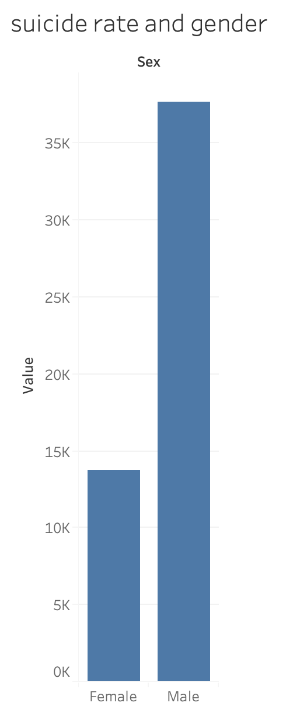
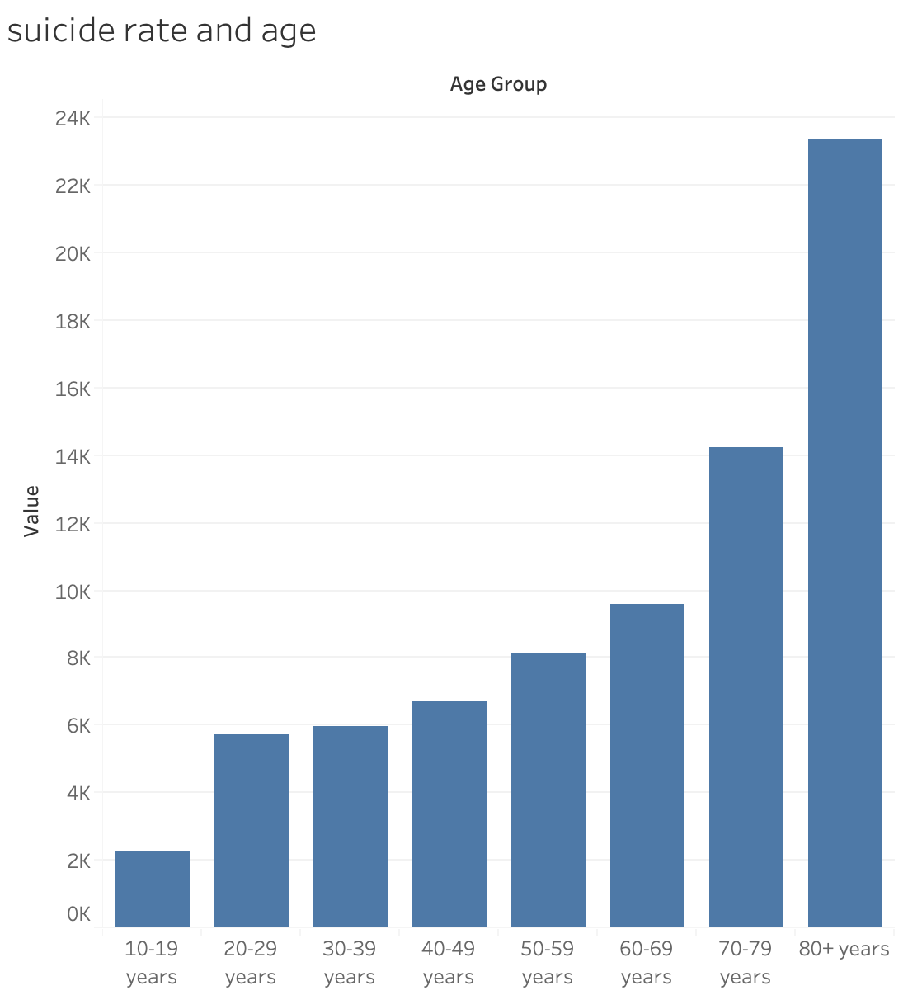

# PART I: This is the outline of my final project
## my one setence discriptor: Suicide is closer to us than we thought.
Mental health is more important than many of us perceived. Sometimes we are not that healthy, and suicide is actually very close to us. 

## The story arc
First I will show the overall suicide rate around the globe. I want to use some vivid visualization that shows the rate is actually pretty high. And then pick several countries with high suicide rates, to state the point one step forward. 
The audience might be wondering what kind of factor will contribute to high suicide rate. I will analyze some factors that could be related to suicide rate. Income, gender, income group of country, facilities etc. 
There are severa things we as normal person can do, other things the government can help us with a little, for example, resources and facilities.

## Plan for the final project
I think I will be using Shorthand, but I am still getting used to it now.

## The data
I started with suicide data from WHO, the link is [here](https://apps.who.int/gho/data/node.main.MENTALHEALTH?lang=en). This dataset includes suicide crude rate data and some factors data I will analyze.
I am still working on other datasets, will update here later.

## Initial sketches
I started from the WHO data and mocked up several visualization with Tableau. Those are all about factors that relate to suicide rate.
* 
* 
* Suicide rate & Country Income

<noscript></noscript><object class='tableauViz'  style='display:none;'><param name='host_url' value='https%3A%2F%2Fpublic.tableau.com%2F' /> <param name='embed_code_version' value='3' /> <param name='site_root' value='' /><param name='name' value='suiciderateandcountryincome&#47;suiciderateandcountry' /><param name='tabs' value='no' /><param name='toolbar' value='yes' /><param name='static_image' value='https:&#47;&#47;public.tableau.com&#47;static&#47;images&#47;su&#47;suiciderateandcountryincome&#47;suiciderateandcountry&#47;1.png' /> <param name='animate_transition' value='yes' /><param name='display_static_image' value='yes' /><param name='display_spinner' value='yes' /><param name='display_overlay' value='yes' /><param name='display_count' value='yes' /><param name='language' value='zh-Hans' /><param name='filter' value='publish=yes' /></object>

* Suicide rate & Country facilities

<noscript></noscript><object class='tableauViz'  style='display:none;'><param name='host_url' value='https%3A%2F%2Fpublic.tableau.com%2F' /> <param name='embed_code_version' value='3' /> <param name='site_root' value='' /><param name='name' value='suiciderateandfacilities&#47;Sheet4' /><param name='tabs' value='no' /><param name='toolbar' value='yes' /><param name='static_image' value='https:&#47;&#47;public.tableau.com&#47;static&#47;images&#47;su&#47;suiciderateandfacilities&#47;Sheet4&#47;1.png' /> <param name='animate_transition' value='yes' /><param name='display_static_image' value='yes' /><param name='display_spinner' value='yes' /><param name='display_overlay' value='yes' /><param name='display_count' value='yes' /><param name='language' value='zh-Hans' /><param name='filter' value='publish=yes' /></object>

## User research

* Target audience: general public who are concerned about mental health problems, and would like to know how the policy makers are doing on this problem. 
* Study objects: several friends of mine. I pick three of my friends, they all come from multi-cultural background and cares about mental health, they would help me make comparison between countries.
* Interview script: 
 * Consent Form: Hi I am a student from CMU, I am working on a course project on mental health, and would like to hear your personal opinion on this topic. Do you mind abswering some questions for me? This interview is confidential and voluntary, I am not evaluating you in any way. You can stop it at any time you want. Do you consent to participate in this interview?
 * General: 
  * Can you tell me your feeling about the word "mental health"? How do you interpret it?
  * Do you think bad mental state will cause severe consequences? What factors do you think will contribute to that?
 * Factors:
  * Do you think there would be a difference because of gender? What about age?
  * What is your reason for assuming that factor will contribute to suicide rate?
 * Policy:
  * How would you say your contry has been doing in this aspect?
  * Who do you think the government or policy makers should be trying harder for providing help on this?
  * Any other comments on this topic? Any questions for me?

## User research findings

Generally, people tend to think cultural factor will contribute the most to suicide rate. Maybe it is because all people that I interviewed have multi-cultural background, they all made a comparison across different societies. Asian societies tend to have more murla constraints and conventions on people, thus would possibly bring more pressure, leading to higher suicide rate.
The second factor might be age group, one of my friends think younger people will possibly have higher suicide rate, for they have less resources when things come up, less strategies they can adopt to deal with pressure. One friend says it is not a specific age group, it should be transition time that suicide will possibly happen the most commonly, like when people first started college, or have their first job.
My friends think gender is not a common factor for suicide rate difference. But I personlly think female are better in dealing emotions, I think I read it from a scientific research.
My friends all think for policy makers, the first priority is to promote awareness for mental health. In some cultures, people are still holding biased opinions for turning to professionals for help with their emotions. It could take years to deal with, but the first step should be made boldly.

## Changes to my story

I notice my audience possibly has some idea about different cultural backgrounds and their relation to suicide rate. I want to try and make comparison of suicide rate across continents, and see if there are any findings there. 
Cultural background is one thing, the other would be economic background of each country, I would like to use color to stress that in my chart.
I started a sketch like this.

<noscript></noscript><object class='tableauViz'  style='display:none;'><param name='host_url' value='https%3A%2F%2Fpublic.tableau.com%2F' /> <param name='embed_code_version' value='3' /> <param name='site_root' value='' /><param name='name' value='suiciderateandcontinent&#47;suiciderateandcontinent' /><param name='tabs' value='no' /><param name='toolbar' value='yes' /><param name='static_image' value='https:&#47;&#47;public.tableau.com&#47;static&#47;images&#47;su&#47;suiciderateandcontinent&#47;suiciderateandcontinent&#47;1.png' /> <param name='animate_transition' value='yes' /><param name='display_static_image' value='yes' /><param name='display_spinner' value='yes' /><param name='display_overlay' value='yes' /><param name='display_count' value='yes' /><param name='language' value='zh-Hans' /><param name='filter' value='publish=yes' /></object>

# PART II: Revision and the final product

## Revision after user testing

After getting feedback from Eileen and my friends, I started to think about how to convey my audience with the data I have. I think that is the main problem with this project. 

Since I only have one minute to present, I decide to go with a simple misundertanding, and not go into details about the reason for high suicide rates. My choice of misunderstanding is from the interview, my friends think suicide is far away from their lives. I then decide to show several charts to demostrate suicide situation is severe all around the world. And I want to make a point about the demographic of people that commit suicide. I attempted to explore the reasons for high suicide rate for specific groups, but after deep dive into research, I realize it is such a huge topic, and researchers all have different opinions towards that.

And for that reason, I think my target audience will also switch. Now I am speaking to the general public, especially those who don't care about mental health. I want to raise their awareness for suicide, and hopefully this presentation will serve some good.

## The data

After feedback from part I, I modified my direction and referred to other resources and analysis. 
The resources are listed in detail in shorthand presentation.

## Shorthand presentation
https://carnegiemellon.shorthandstories.com/hanxue-dataviz/index.html

## My journey and reflection
I started this project from a vague idea, I want to make something about health. But what exactly? No idea. Then I thought it might be a nice start to look at data first, what dataset I can get my hands on... So I went to WHO website, and there was a huge dataset on suicide rate and demograohic information. That is the base of my "analyzing the demograohic" part of presentation.
I talked to my friends about their thoughts on suicide, what kinds of people might commit suicide, and how to improve on the current situation. I noticed they have mixed ideas about suicide, but generally think suicide is not that common. When I brought the data that said America had two time suicide cases compared to homicide, they were surprised. I thought that could be a starting point. 
For the demographic part, I used several different yet simple charts to show direct information: how suicide rate changes with age, gender, and country. It was a painful process, although the final charts seem simple, I spent a lot of time cleaning the data. I think WHO's data set might work better with R or Python, than Tableau.

